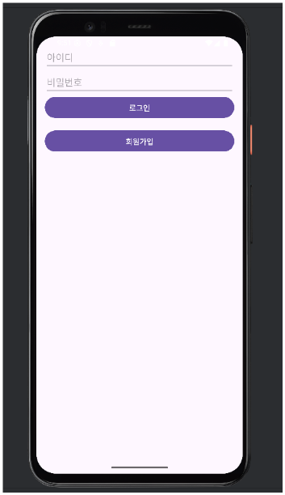
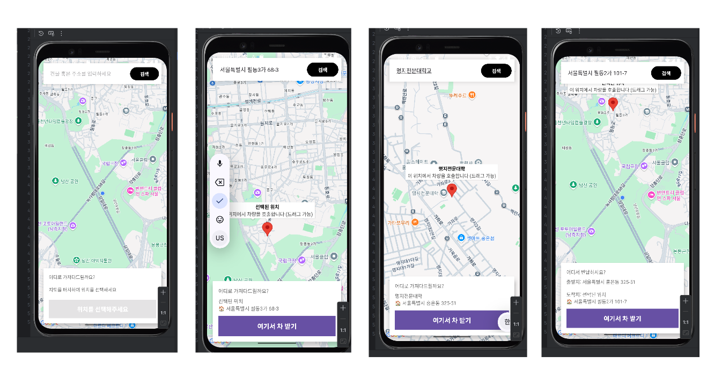
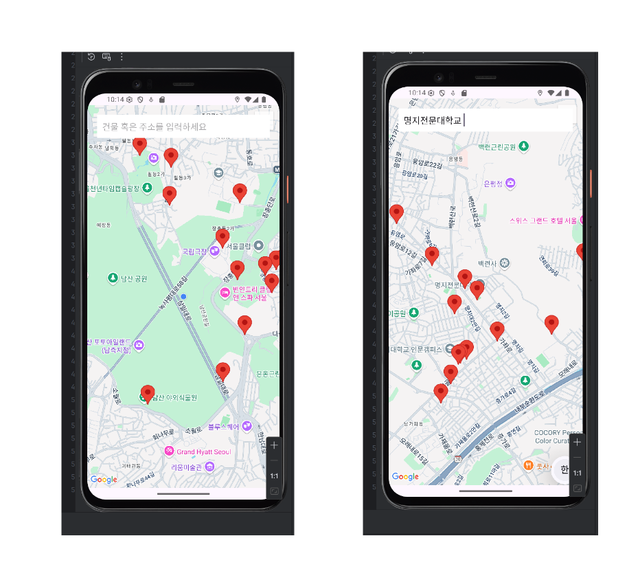
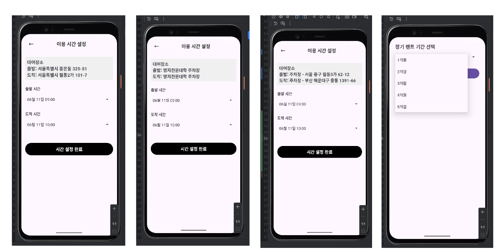
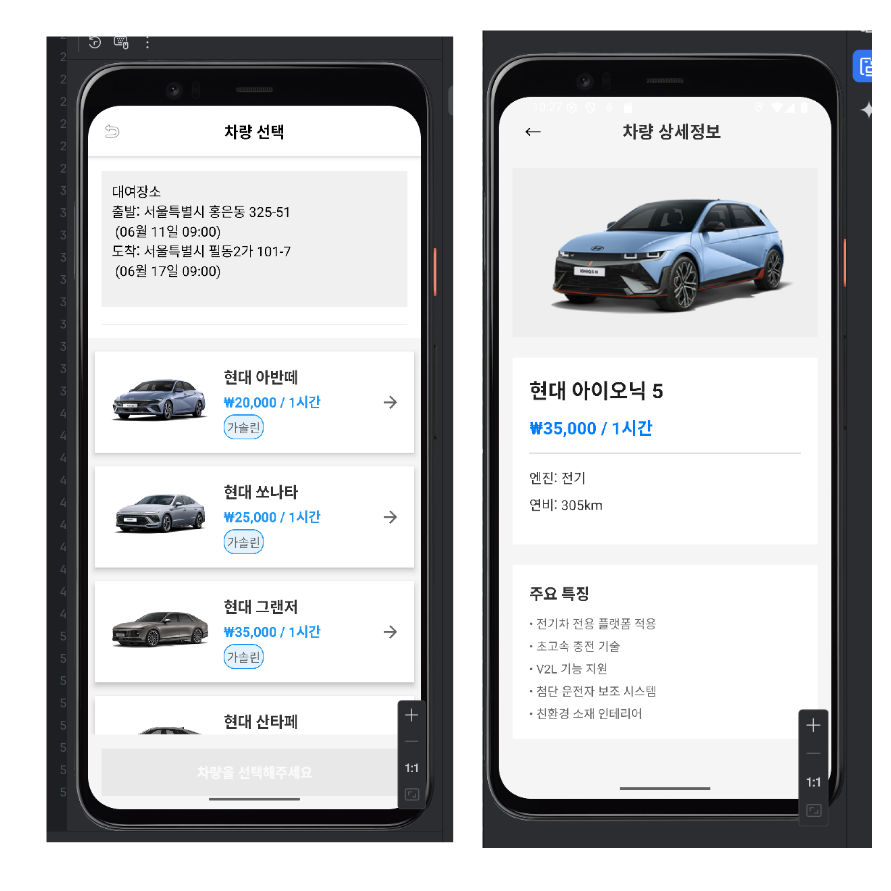
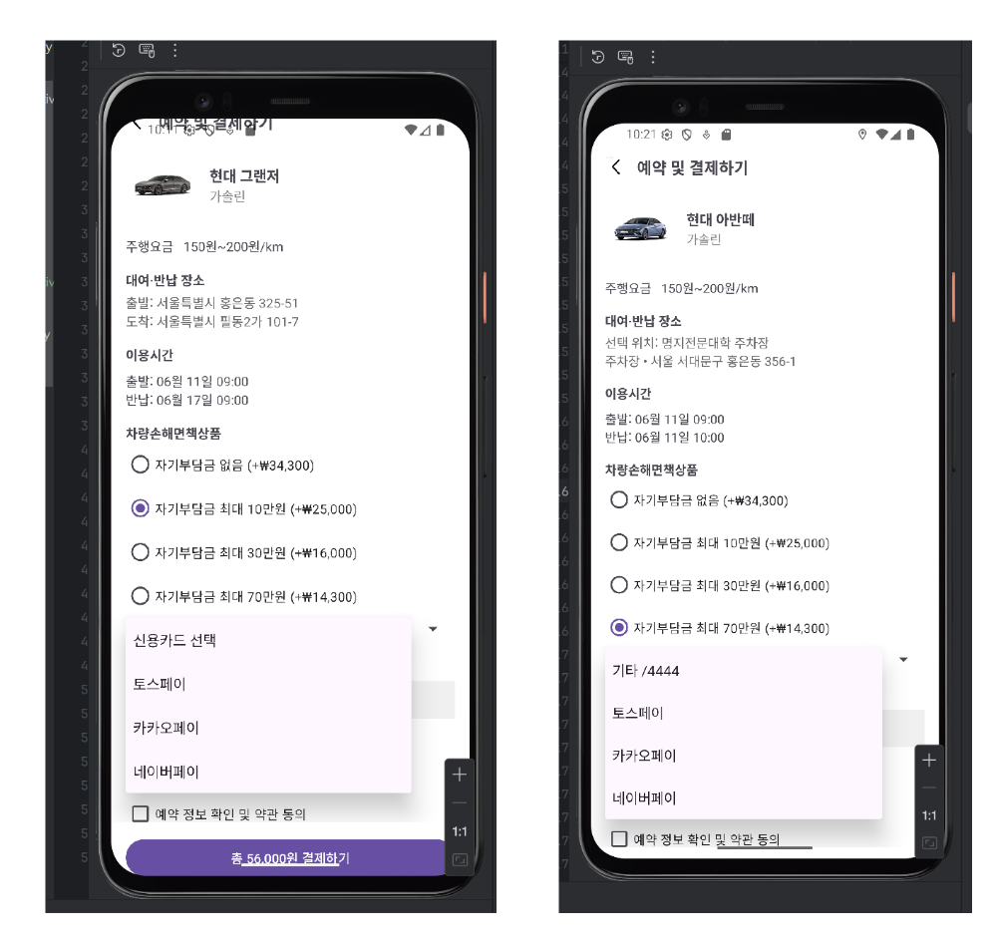
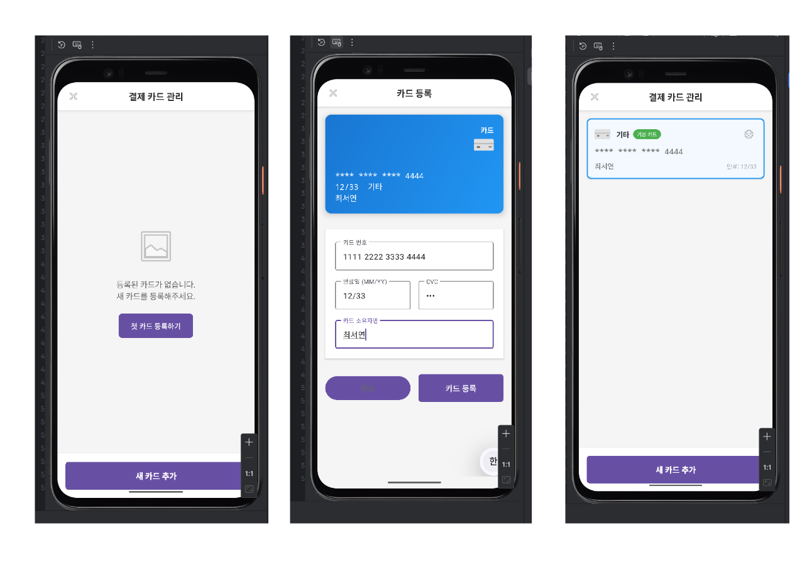
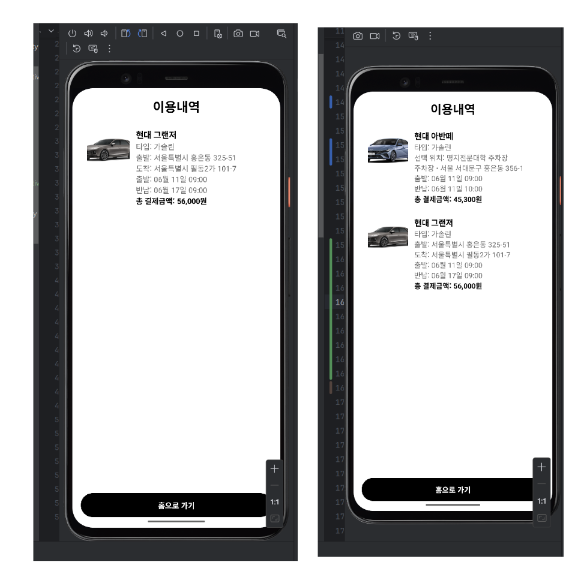
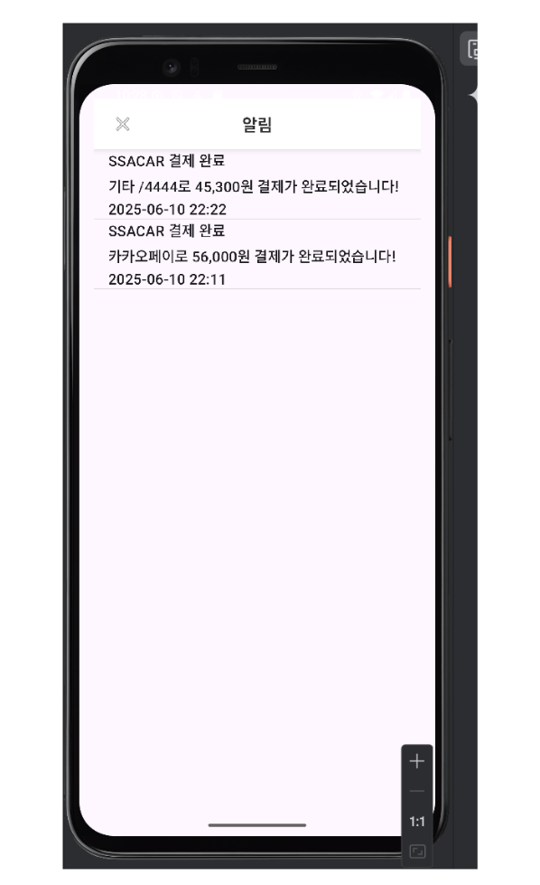

### 🚘 SSACAR — 카셰어링 앱 프로젝트

2025 MJC 모바일 앱 프로그래밍 실습 팀 프로젝트

</div>

  
<br>

## 📜 0. 목차
1. [프로젝트 소개](#1)
2. [팀원 소개](#2)
3. [개발 일정](#3)
4. [기술 스택](#4)
5. [브랜치 및 디렉토리 구조](#5)
6. [주요 기능 소개](#6)
7. [상세 담당 업무](#7)
8. [주요 기술 구현 및 도전 과제](#8)
9. [트러블 슈팅](#9)
10. [개선 목표](#10)
11. [프로젝트 후기](#11)

<br>

## 📝 <span id=1> 1. 프로젝트 소개</span>

SSACAR는 사용자가 차량을 손쉽게 대여·반납할 수 있는 모바일 카셰어링 플랫폼입니다.
기존 쏘카(SOCAR), 그린카와 같은 서비스를 참고하여, 로그인부터 차량 대여, 결제까지 모든 과정을 앱 하나로 구현하는 것을 목표로 개발했습니다.

* 사용자는 현재 위치 기반으로 가까운 주차장에서 차량을 선택하고 예약 가능

* 시간 및 기간 설정 기능을 통해 원하는 기간 대여 가능

* 결제 및 카드 등록 기능을 통해 예약 절차 간소화

* 토스트 알림 및 이용내역 조회 기능으로 사용자 경험 향상


<br><br>

## 🙋‍♂️ <span id=2>  2. 팀원 소개</span>

|학번|이름|개발|
|:------:|:---:|:---:|
|2022261067|<a href="https://github.com/chltj" target="_blank" rel="noopener noreferrer">최서연</a>|총괄, Front-End,Back-End|
|2021261009|<a href="https://github.com/ksw170" target="_blank" rel="noopener noreferrer">김상원</a>| Front-End,Back-End|
|2021261045|<a href="https://github.com/ysc0412" target="_blank" rel="noopener noreferrer">윤석찬</a>| Front-End,Back-End|
|2023261019|<a href="https://github.com/kim-doh-yun" target="_blank" rel="noopener noreferrer">김도현</a>| Front-End,Back-End|


<br><br>

## ⌛ <span id=3> 3. 개발 일정</span>

> 기획 및 설계: 2025.04.15 ~ 2025.04.28
(기능 명세서 및 화면 설계, 프로세스 구상)

> 개발 기간: 2025.04.29 ~ 2025.06.09

<br><br>

## 🛠️ <span id=4> 4. 기술 스택</span>
> 개발 환경: Android Studio (Java)

🖥️ Front-end

* Java (Android): Android Studio에서 메인 개발 언어로 사용하여 앱 UI 및 기능 구현
  
* XML Layout: 앱 화면의 구조 및 레이아웃 설계 (ConstraintLayout, LinearLayout 등 활용)
  * RecyclerView: 차량 리스트 및 알림 내역 리스트 UI 구현에 사용
  * Spinner & Date/Time Picker: 기간 및 시간 설정 기능 구현
  * Toast UI: 결제 및 알림 기능에서 실시간 피드백 메시지 표시
    
* Kakao Map API / Google Map API: 사용자 위치 기반 주차장 검색 및 핀 표시 기능 구현
    
* OkHttp / Retrofit: 외부 API 및 서버 통신 시 사용 (차량 정보 및 위치 데이터 연동)
* Glide: 차량 이미지 로딩 및 캐싱 처리

<br>

⚙️ Back-end

* Firebase Authentication: 회원가입 및 로그인 기능 구현 (ID/PW 기반 인증)

* Firebase Realtime Database: 사용자, 차량, 예약, 결제 데이터 실시간 저장 및 관리

* Firebase Storage: 이미지 또는 기타 데이터 저장 용도로 사용

* REST API: Retrofit을 통한 API 연동으로 차량 정보(현대 API) 불러오기

* OkHttpClient: 서버와의 통신 및 데이터 요청/응답 처리

* Java: 예약/결제 로직 및 화면 전환 제어 처리


<br>

🗄️ Database

* Firebase Realtime Database
  * 회원 정보, 면허 정보, 예약 내역, 차량 정보, 결제 내역 저장
  * JSON 구조 기반 실시간 데이터 반영
  * 예약 시 시간 중복 체크 및 데이터 검증 처리

* 현대 API (Hyundai Open API)
  * 차량 이미지, 이름, 연비 등 차량 정보 불러오기 및 리스트 반영

<br>

🚀 Build & Deployment

* Android Studio: 전체 앱 개발 및 빌드 환경
  
* Gradle: 의존성 관리 및 빌드 자동화

* GitHub: 버전 관리 및 팀원 협업

* APK 빌드 및 배포: Android 기기에 앱 설치 및 테스트 진행

<br><br>

## 🗂️ <span id="5"> 5. 브랜치 및 디렉토리 구조</span>

> 브랜치

- 'main' : 프로젝트 진행 중 항상 최신 상태로 유지하며, Stable 상태로 배포되어 바로 사용 가능한 브랜치입니다.

- 'seoyeon', 'credit', 'Kimdohyun', '윤석찬' : 개발 팀원들의 브랜치입니다.<br>각자가 맡은 기능 Test가 해당 각 브랜치에서 진행되며, 최종 Stable 버전을 Merge하여 main 브랜치에 푸시합니다.

<br>

> 디렉토리 구조

<br>

<details> <summary>📂 전체 프로젝트 구조 보기 (클릭하여 펼치기)</summary>

```text
📦main
 ┣ 📜AndroidManifest.xml
 ┣ 📂java
 ┃ ┗ 📂com
 ┃ ┃ ┗ 📂example
 ┃ ┃ ┃ ┃ ┗ 📂ssacar
 ┃ ┃ ┃ ┃ ┃ ┣ 📂activity
 ┃ ┃ ┃ ┃ ┃ ┣ 📜SplashActivity.java
 ┃ ┃ ┃ ┃ ┃ ┣ 📜LoginActivity.java
 ┃ ┃ ┃ ┃ ┃ ┣ 📜RegisterActivity.java
 ┃ ┃ ┃ ┃ ┃ ┣ 📜LicenseRegisterActivity.java
 ┃ ┃ ┃ ┃ ┃ ┣ 📜MainActivity.java
 ┃ ┃ ┃ ┃ ┃ ┣ 📜MapCallHereActivity.java          # 여기로 부르기
 ┃ ┃ ┃ ┃ ┃ ┣ 📜MapPickupActivity.java            # 가지러 가기 / 편도
 ┃ ┃ ┃ ┃ ┃ ┣ 📜TimeSettingActivity.java          # 시간/기간 설정
 ┃ ┃ ┃ ┃ ┃ ┣ 📜CarListActivity.java
 ┃ ┃ ┃ ┃ ┃ ┣ 📜CarDetailActivity.java
 ┃ ┃ ┃ ┃ ┃ ┣ 📜PaymentActivity.java
 ┃ ┃ ┃ ┃ ┃ ┣ 📜CardListActivity.java
 ┃ ┃ ┃ ┃ ┃ ┣ 📜CardAddActivity.java
 ┃ ┃ ┃ ┃ ┃ ┣ 📜HistoryActivity.java              # 이용내역
 ┃ ┃ ┃ ┃ ┃ ┗ 📜NotificationActivity.java         # 알림
 ┃ ┃ ┃ ┃ ┣ 📂adapter
 ┃ ┃ ┃ ┃ ┃ ┣ 📜CarListAdapter.java
 ┃ ┃ ┃ ┃ ┃ ┣ 📜HistoryListAdapter.java
 ┃ ┃ ┃ ┃ ┃ ┗ 📜NotificationListAdapter.java
 ┃ ┃ ┃ ┃ ┣ 📂model
 ┃ ┃ ┃ ┃ ┃ ┣ 📜User.java
 ┃ ┃ ┃ ┃ ┃ ┣ 📜License.java
 ┃ ┃ ┃ ┃ ┃ ┣ 📜ParkingLot.java
 ┃ ┃ ┃ ┃ ┃ ┣ 📜Car.java
 ┃ ┃ ┃ ┃ ┃ ┣ 📜Reservation.java
 ┃ ┃ ┃ ┃ ┃ ┣ 📜Payment.java
 ┃ ┃ ┃ ┃ ┃ ┗ 📜Notice.java
 ┃ ┃ ┃ ┃ ┣ 📂api
 ┃ ┃ ┃ ┃ ┃ ┣ 📜HyundaiApiService.java            # 현대 API 연동
 ┃ ┃ ┃ ┃ ┃ ┣ 📜MapApiService.java                # Kakao/Google Map
 ┃ ┃ ┃ ┃ ┃ ┣ 📜ApiClient.java                    # Retrofit/OkHttp 클라이언트
 ┃ ┃ ┃ ┃ ┃ ┗ 📜ApiInterceptor.java
 ┃ ┃ ┃ ┃ ┣ 📂firebase
 ┃ ┃ ┃ ┃ ┃ ┣ 📜AuthManager.java                  # Firebase Auth 래퍼
 ┃ ┃ ┃ ┃ ┃ ┣ 📜DbManager.java                    # Realtime DB 접근
 ┃ ┃ ┃ ┃ ┃ ┗ 📜StorageManager.java               # (이미지 등) Storage
 ┃ ┃ ┃ ┃ ┣ 📂utils
 ┃ ┃ ┃ ┃ ┃ ┣ 📜TimeUtils.java
 ┃ ┃ ┃ ┃ ┃ ┣ 📜FormatUtils.java
 ┃ ┃ ┃ ┃ ┃ ┣ 📜Constants.java
 ┃ ┃ ┃ ┃ ┃ ┗ 📜PrefHelper.java                   # SharedPreferences
 ┃ ┃ ┃ ┃ ┗ 📂repository
 ┃ ┃ ┃ ┃ ┣ 📜CarRepository.java
 ┃ ┃ ┃ ┃ ┣ 📜ReservationRepository.java
 ┃ ┃ ┃ ┃   ┗ 📜PaymentRepository.java
 ┣ 📂res
 ┃ ┣ 📂layout
 ┃ ┃ ┣ 📜activity_splash.xml
 ┃ ┃ ┣ 📜activity_login.xml
 ┃ ┃ ┣ 📜activity_register.xml
 ┃ ┃ ┣ 📜activity_license_register.xml
 ┃ ┃ ┣ 📜activity_main.xml
 ┃ ┃ ┣ 📜activity_map_call_here.xml
 ┃ ┃ ┣ 📜activity_map_pickup.xml
 ┃ ┃ ┣ 📜activity_time_setting.xml
 ┃ ┃ ┣ 📜activity_car_list.xml
 ┃ ┃ ┣ 📜item_car.xml
 ┃ ┃ ┣ 📜activity_car_detail.xml
 ┃ ┃ ┣ 📜activity_payment.xml
 ┃ ┃ ┣ 📜activity_card_list.xml
 ┃ ┃ ┣ 📜activity_card_add.xml
 ┃ ┃ ┣ 📜activity_history.xml
 ┃ ┃ ┣ 📜item_history.xml
 ┃ ┃ ┣ 📜activity_notification.xml
 ┃ ┃ ┗ 📜item_notification.xml
 ┃ ┣ 📂drawable
 ┃ ┃ ┣ 📜bg_button.xml
 ┃ ┃ ┣ 📜shape_card.xml
 ┃ ┃ ┗ 📜selector_btn_primary.xml
 ┃ ┣ 📂mipmap-anydpi-v26
 ┃ ┃ ┗ 📜ic_launcher.xml
 ┃ ┣ 📂mipmap-hdpi
 ┃ ┣ 📂mipmap-mdpi
 ┃ ┣ 📂mipmap-xhdpi
 ┃ ┣ 📂mipmap-xxhdpi
 ┃ ┣ 📂mipmap-xxxhdpi
 ┃ ┣ 📂values
 ┃ ┃ ┣ 📜colors.xml
 ┃ ┃ ┣ 📜strings.xml
 ┃ ┃ ┣ 📜themes.xml
 ┃ ┃ ┗ 📜styles.xml
 ┃ ┣ 📂values-night
 ┃ ┃ ┗ 📜themes.xml
 ┃ ┗ 📂xml
 ┃   ┗ 📜network_security_config.xml
 ┗ 📂assets
   ┗ 📜mock_parkinglots.json                  # (선택) 목데이터
```
</details>

<br> <br>

## 💻 <span id="6"> 6. 주요 기능 소개</span>
<br><br>
해당 사이트를 실제로 구동해보기 위한 번거로운 작업(DB 설정, 라이브러리 설치, 서버 설치 및 실행)이 너무나 많기에 사이트 주요 기능들에 대해서<br>gif 형식으로 첨부하여 소개합니다.


## 🚀 주요 기능 소개

### 1. 로그인 화면
       * 로그인 전에는 차량 리스트를 제외한 모든 버튼 클릭 시 로그인 안내 메시지 출력
       * 로그인 페이지에서 회원가입 버튼 클릭 시 회원가입 페이지로 이동

<br><br>

### 2. 면허 등록
       * 로그인 전에는 차량 리스트를 제외한 모든 버튼 클릭 시 로그인 안내 메시지 출력

<br><br>

### 3. 면허증(리스트)
       * 마이페이지에서 면허 정보 클릭 시 등록된 면허 리스트 표시

<br><br>

### 4. 마이페이지
       * 회원가입 시 작성한 정보(아이디, 이름, 전화번호)와 면허 등록 상태 표시

<br><br>

### 5. 구글 맵 지도
       * 핀 설정, 검색으로 주소 불러오기 / 내 위치 기반 주차장 핀 표시


<br><br>

### 6. 시간 설정
       * 도착 시간보다 출발 시간이 늦지 않도록 자동 보정, 장기렌트 최소 1~5개월


<br><br>

### 7. 차량 선택
       * 선택한 위치·시간에 맞는 차량 정보(이미지·연비 등) 표시 후 상세보기 진입

<br><br>


### 8. 결제페이지
       * 차량 정보, 대여/반납장소, 이용시간, 보험료를 합산하여 결제 진행

<br><br>

### 9. 카드등록
       * 카드 등록 후 결제 수단에 표시되며 만료일, CVC 포함 입력

<br><br>

### 10. 이용내역
       * 결제 후 차량명, 위치, 시간, 금액을 내역 리스트로 표시

<br><br>

### 11. 알림
       * 결제 후 토스트 메시지 → 알림 탭에 저장되어 리스트로 표시

<br><br>


<br><br>

## 📄 <span id="7"> 7. 상세 담당 업무</span>

#### 1) 최서연 (branch: seoyeon)

- **🎨 UI**

  - 페이지: 메인 화면, 구글 지도 화면, 시간/기간 설정, 차량 리스트/상세 정보, 이용내역, 알림

  - 공통 컴포넌트 제작: 차량 리스트 UI, 알림 표시 토스트, 지도 관련 기능

- **🎯 중점 개발 내용**

  - Google Maps API 연동: 사용자 위치 기반 지도 표시 및 마커(주차장 위치) 출력 기능 구현

  - 차량 리스트 기능: 선택한 시간 및 위치 기반으로 차량 목록 출력 및 상세 정보 페이지 연동

  - 시간/기간 설정 기능: 단기 및 장기 렌트 시간 계산 로직 및 UI 설계

  - 이용 내역 및 알림 기능: 결제 완료 후 내역 저장 및 알림 탭에 실시간 반영

  - UI/UX 향상: 지도 화면 애니메이션 효과, 리스트 정렬 및 필터링, 직관적인 버튼 배치
 

#### 2) 김상원 (branch: credit)

- **🎨 UI**
  - 페이지: 결제 페이지, 카드 등록 페이지

  - 공통 컴포넌트 제작: 카드 등록 및 결제 정보 처리 폼, 결제 프로세스 UI


- **🎯 중점 개발 내용**
  - 결제 기능 구현: 예약 차량 및 시간 데이터를 기반으로 결제 로직 설계 및 처리

  - 카드 등록 기능: 사용자 카드 정보 등록 및 저장 후 결제와 연동

  - UI/UX 향상: 결제 과정 단계별 안내 및 오류 메시지 처리

  - 예외 처리 로직: 결제 중 오류 상황(정보 미입력, 네트워크 오류 등) 대응 및 사용자 안내 강화

  - 예약 정보 반영: 결제 완료 후 내역 페이지에 실시간 반영

#### 3) 윤석찬 (branch: 윤석찬)

- **🎨 UI**
  
  - 페이지: 면허 등록, 면허 리스트 페이지

  - 공통 컴포넌트 제작: 면허 등록 폼, 면허 리스트 RecyclerView
    

- **🎯 중점 개발 내용**
  
  - 면허 정보 등록 기능 구현: 사용자 입력값 기반 면허 정보 DB 저장 및 조회 기능 구현

  - UI/UX 향상: 등록된 면허를 보기 쉽게 리스트 형태로 구성

  - 데이터 연동: Firebase Realtime Database를 통한 면허 등록/조회 기능 구현

  - 예외 처리: 빈 입력값, 유효하지 않은 면허정보 입력 시 경고 메시지 처리


#### 4) 김도현 (branch: kimdohyun)

- **🎨 UI**

  - 페이지: 로그인, 회원가입

  - 공통 컴포넌트 제작: 로그인/회원가입 입력 폼, 계정 생성 및 로그인 유지 처리

- **🎯 중점 개발 내용**

  - 인증 기능 구현: 로그인 및 회원가입 로직 설계, 사용자 입력값 검증 처리

  - UI/UX 향상: 간결하고 직관적인 입력 폼 구성 및 에러 메시지 출력 처리

  - Firebase 인증 연동: 사용자 계정 정보 저장 및 로그인 상태 관리

  - 예외 처리 로직 강화: 비밀번호 불일치, 중복 계정 등에 대한 사용자 피드백 제공
<br>

## 🚀 <span id="8"> 8. 주요 기술 구현 및 도전 과제</span>
**Android 아키텍처 패턴 적용 (Activity & Fragment 기반)** 

- Activity, Fragment, Adapter를 분리하여 역할을 명확히 구성

- UI 처리와 데이터 로직을 분리해 유지보수성과 확장성 향상

- RecyclerView + Adapter 구조를 통해 효율적인 리스트 UI 구현

**Google Maps API 연동**

- 사용자 현재 위치 기반으로 지도에 마커 표시

- 차량 픽업 지점과 반납 지점 시각화

- 위치 검색 및 GPS 기반 위치 정보 실시간 반영

**차량 선택 및 결제 기능 구현**

- 시간/기간 설정 후 조건에 맞는 차량을 RecyclerView로 출력

- 차량 상세 정보 화면에서 예약 진행 및 결제 페이지로 연동

- 카드 등록 및 결제 로직을 통해 예약 정보 DB에 반영-

- 결제 완료 후 알림 및 이용 내역 자동 저장

**Firebase 연동 및 사용자 인증**

- Firebase Authentication을 활용한 로그인 및 회원가입 기능 구현

- Firebase Realtime Database를 통한 면허 정보, 결제 정보, 예약 내역 관리

- 로그인 상태 유지 및 사용자별 맞춤 정보 관리 기능 구현

**UI/UX 개선**

- 화면 전환 시 애니메이션 효과 적용으로 자연스러운 흐름 구현

- Toast, Snackbar, Dialog 등을 활용한 직관적인 알림 제공

- 지도, 차량 선택, 결제까지의 사용자 동선 설계로 사용성 향상

**에러 처리 및 유효성 검사**

- 잘못된 입력(로그인, 회원가입, 결제, 면허등록 등)에 대한 클라이언트 측 실시간 검증

- Toast 및 AlertDialog를 통한 사용자 친화적 오류 안내

- 네트워크 오류 및 예외 상황 발생 시 안정적인 예외 처리 로직 적용

- 필수 입력값 누락, 형식 오류 등에 대한 즉각적인 피드백 제공

<br>
## 💥 <span id="9"> 9. 트러블 슈팅</span>

### 1. 지도 마커 및 위치 갱신 오류 문제

- 앱 개발 초기에 Google Maps API를 활용하여 현재 위치와 차량 픽업 가능 지점을 표시하는 과정에서
일부 기기에서 마커가 정상적으로 표시되지 않거나 위치가 갱신되지 않는 문제가 발생했습니다.
<br>
- 처음에는 API 키 자체의 문제로 생각했지만, 위치 권한 설정 및 API Key 환경 설정 문제라는 결론에 도달했습니다.
- 특히 SHA-1 키가 debug 환경에만 등록되어 있어 release 환경에서 오류가 발생하고 있었습니다.
<br>

### 💥원인 분석

- Google Cloud Platform의 API Key 설정이 debug용으로만 등록되어 있었음

- 위치 권한 요청 로직이 MainActivity에서만 적용되어 일부 화면에서 동작하지 않음

- 지도 객체 초기화 타이밍이 늦어 마커 생성이 지연됨

### 🚀 해결 방법

- release 환경의 SHA-1 키를 GCP 콘솔에 추가하여 API Key 범위 수정

- FusedLocationProviderClient를 활용하여 모든 지도 화면에서 실시간 위치 갱신 가능하도록 변경

- 위치 권한 체크 및 지도 초기화 로직을 분리하여 재사용성 확보

- 지도 로딩 후 마커 생성 및 카메라 이동 로직을 순차적으로 적용해 오류 해결

- 수정 후 모든 기기에서 마커가 정상적으로 표시되고 위치 갱신이 원활히 동작함을 확인했습니다.


<br><br>


### 2.현대 API 차량 리스트 불러오기 문제

- 차량 예약 기능 구현을 위해 현대 API를 연동하여 차량 리스트를 불러오는 과정에서
- API 응답이 정상적으로 오지 않거나 앱이 멈추는 현상이 발생했습니다.
<br>
- 처음에는 단순히 URL 또는 인증키 문제라고 생각했지만,
- 결국 API 호출 방식과 인증 처리 로직, 비동기 통신 타이밍에 문제가 있었던 것으로 밝혀졌습니다.

### 💥 원인 분석

- 현대 API의 인증 토큰이 일정 시간이 지나면 만료되는 문제

- Retrofit 통신 시 토큰이 만료된 상태에서 요청이 반복되어 401 Unauthorized 오류 발생

- UI 스레드(Main Thread)에서 네트워크 요청이 처리되어 ANR(앱 멈춤) 현상 발생

- 응답 JSON 구조가 예상과 달라 파싱 오류도 발생함
<br>

### 🚀 해결 방법

- 토큰 갱신 로직을 별도의 비동기 함수로 분리하여 유효 토큰 유지

- Retrofit2 + Coroutine을 사용해 비동기 API 통신 구조로 변경

- Gson으로 JSON 응답을 구조화하고 DTO(Data Class)로 안전하게 매핑

- 네트워크 요청 시 로딩 ProgressBar를 추가하여 사용자 경험 개선

- 수정 후 차량 리스트가 안정적으로 출력되고, 네트워크 환경이 불안정할 때도 앱이 멈추지 않게 되었습니다.
<br><br>

### 3. 결제 진행 중 화면 멈춤 현상

- 결제 로직을 메인 스레드에서 처리하던 초기 버전에서, 결제 버튼 클릭 후 화면이 멈추는 현상이 발생했습니다.
- 특히 네트워크가 느린 환경에서는 앱이 멈춘 것처럼 보이는 UX 저하 문제가 생겼습니다


### 💥 원인 분석

- 네트워크 통신 및 결제 로직이 UI 스레드(Main Thread)에서 실행됨

- 비동기 처리가 미흡해 로딩 중 사용자 피드백이 제공되지 않음

<br>

### 🚀 해결 방법

- 결제 로직을 별도의 비동기 처리(AsyncTask / Coroutine)로 분리

- 결제 중 로딩 ProgressBar를 표시해 사용자에게 진행 상태 안내

- 네트워크 실패 시 예외 처리를 통해 AlertDialog로 재시도 안내
  
- 화면 멈춤 현상이 사라지고, 결제 과정의 사용자 경험이 크게 개선되었습니다.
<br><br>

## 💭 <span id="10"> 10. 개선 목표</span>


### 🚀 앱 성능 및 사용자 경험 개선 목

| Category | 개선 방향 | 기대 효과 |
| :--- | :--- | :---: |
| 🟠 **Performance** | **지도 로딩 최적화, 이미지 경량화, RecyclerView 성능 개선**  |  **화면 로딩 시간 단축 및 UX 향상**  |
| 🟢 **Accessibility** | **버튼 및 글자 색상 대비 강화, 에러 메시지 명확화**  |  **사용자 가독성 향상 및 직관적인 피드백 제공**  |
| 🟢 **Best Practices** | **비동기 처리 일원화, 공통 UI 컴포넌트 분리**  | **유지보수성 향상 및 코드 중복 제거**  |
| 🟢 **UX 향상** | **결제 과정 중 로딩 화면 및 안내 메시지 추가**  | **사용자 경험 개선 및 이탈률 감소**  |


### 🎯 개선 필요사항

- [ ] Google Maps API 로딩 최적화 및 마커 데이터 Lazy Loading 적용

- [ ] 결제 및 예약 과정에서 사용자 피드백(UI) 강화

- [ ] RecyclerView 데이터 처리 최적화 및 DiffUtil 전면 적용

- [ ] AlertDialog 및 Snackbar 메시지 통일로 사용자 안내 일관성 확보

- [ ] 전체 화면 전환 애니메이션 적용으로 UX 부드럽게 개선

<br>

## 🧑‍🤝‍🧑 <span id="11"> 11. 프로젝트 후기</span>
<br>

### 최서연

<br> 이번 프로젝트에서 메인 페이지와 지도, 시간/기간 설정, 차량 리스트 및 알림 기능 등을 담당하면서 **사용자 흐름(UI/UX)**을 고려한 개발의 중요성을 많이 배웠습니다. 처음에는 단순히 기능을 구현하는 데 집중했지만, 실제 사용자가 어떻게 앱을 사용할지를 고민하면서 **화면 전환, 지도 마커 표시, 데이터 처리 흐름**까지 신경을 쓰게 되었습니다.

특히 Google Maps API와 RecyclerView를 연동하면서 비동기 통신과 화면 최적화의 어려움도 겪었지만, 문제를 해결하고 결과물을 완성했을 때 크게 성장했다는 성취감을 느낄 수 있었습니다.

<br><br>
### 김상원


<br><br>

### 윤석찬


<br><br>

### 김도현


<br><br>
